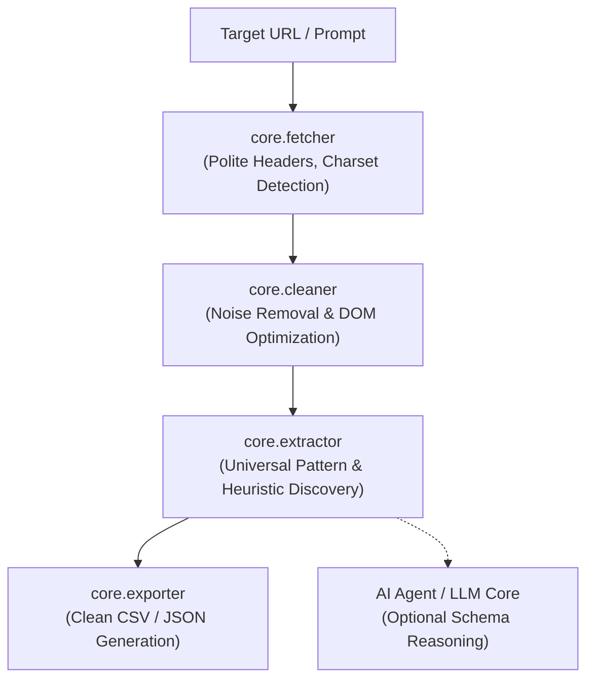

# 🕷️ ScrapeAgent

<p align="center">
  <strong>An Intelligent, Autonomous Web Scraping & Structured Data Extraction Agent</strong>
</p>

<p align="center">
  
  
  
</p>

---

**ScrapeAgent** is a universal web scraping and extraction agent designed to parse web content intelligently. Instead of requiring brittle, hardcoded CSS selectors for every website, ScrapeAgent inspects the DOM, sanitizes noisy markup, identifies repeating patterns (products, listings, articles, cards), and extracts structured data on the fly.

---

## ✨ Features

- 🌐 **Universal URL Extraction**: Automatically discovers repeating content blocks (catalogs, blog feeds, e-commerce listings) across diverse web pages.
- 🧹 **Smart DOM Sanitization**: Removes `<script>`, `<style>`, `<noscript>`, SVGs, and comments to drastically reduce noise.
- 🛡️ **Polite & Resilient HTTP Engine**: Configurable polite `User-Agent` headers, automated timeout protection, and intelligent character encoding detection (preserving symbols like `£`, `$`, `€`, `₺`).
- 📂 **Multi-Format Export**: Clean, automated export to **CSV** or **JSON** formats with proper headers and data types.
- 🧠 **Agent-First Architecture**: Built from the ground up to integrate with AI tool calling (Gemini, OpenAI, Ollama, LangChain) for schema-on-demand scraping.
- 🖥️ **Interactive & Headless CLI**: Run interactively with an intuitive terminal interface or headlessly using command-line arguments.

---

## 🏗️ Architecture



---

## 📁 Project Structure

```text
scrape-agent/
│
├── agent.py               # Main CLI interface (Interactive & Flag-driven)
├── config.py              # Global configurations (User-Agents, timeouts, formats)
│
├── core/                  # Core Agent Engine
│   ├── __init__.py
│   ├── fetcher.py         # HTTP fetching with charset/error resilience
│   ├── cleaner.py         # HTML noise stripping & semantic simplification
│   ├── extractor.py       # Universal pattern detector & heuristic extractor
│   └── exporter.py        # CSV & JSON export utilities
│
├── examples/              # Built-in scraper presets & challenges
│   ├── __init__.py
│   └── book_scraper.py    # Catalog scraper for books.toscrape.com
│
├── requirements.txt       # Project dependencies
├── .gitignore             # Standard Python git exclusions
└── README.md              # Project documentation
```

---

## 🚀 Quickstart

### 1. Installation

Clone the repository and install requirements:

```bash
git clone https://github.com/AslanRunner/scrape-agent.git
cd scrape-agent
pip install -r requirements.txt
```

### 2. Usage Modes

#### A. Interactive Mode
Simply run the agent without flags to enter the interactive terminal menu:
```bash
python agent.py
```

#### B. Direct URL Scraping
Scrape any web page and export to CSV or JSON:
```bash
# Scrape to CSV
python agent.py --url "https://books.toscrape.com/" --output "books.csv"

# Scrape to JSON
python agent.py --url "https://books.toscrape.com/" --output "books.json"
```

#### C. Run the Book Scraper Preset
```bash
python agent.py --demo
```
*(or run `python scrape_books.py`)*

---

## 📊 Sample Output

Running ScrapeAgent on a catalog produces clean structured data:

```text
   _____                               ___                    _   
  / ___/______________ _____  ___     /   | ____ ____  ____  / /_ 
  \__ \/ ___/ ___/ __ `/ __ \/ _ \   / /| |/ __ `/ _ \/ __ \/ __/ 
 ___/ / /__/ /  / /_/ / /_/ /  __/  / ___ / /_/ /  __/ / / / /_   
/____/\___/_/   \__,_/ .___/\___/  /_/  |_\__, /\___/_/ /_/\__/   
                    /_/                  /____/                   
          Intelligent & Autonomous Web Scraping Agent

[+] Agent navigating to: https://books.toscrape.com/
[✓] Status 200 OK (50 KB received)
[+] Sanitizing HTML & stripping noise...
[+] Universal Extractor analyzing DOM structure...
[✓] Discovered 20 structured items!

--- Previewing Extracted Records ---
   1. A Light in the Attic                                 £51.77
      Link: https://books.toscrape.com/catalogue/a-light-in-the-attic_1000/index.html
   2. Tipping the Velvet                                   £53.74
      Link: https://books.toscrape.com/catalogue/tipping-the-velvet_999/index.html
  ... and 18 more items.

[✓] Results successfully exported to: scraped_data.csv
```

---

## 🗺️ Roadmap

- [x] Polite HTTP fetcher with auto-detected charset encoding
- [x] HTML noise stripping and DOM cleaner
- [x] Universal repeating item discovery heuristic
- [x] CSV & JSON data exporter
- [ ] LLM Tool Calling integration (Gemini / OpenAI structured output)
- [ ] Dynamic JavaScript rendering support via Playwright
- [ ] Proxy rotation & polite rate-limiting pool
- [ ] Multi-page automated pagination crawling

---

## 📄 License

Distributed under the MIT License. See `LICENSE` for more information.
