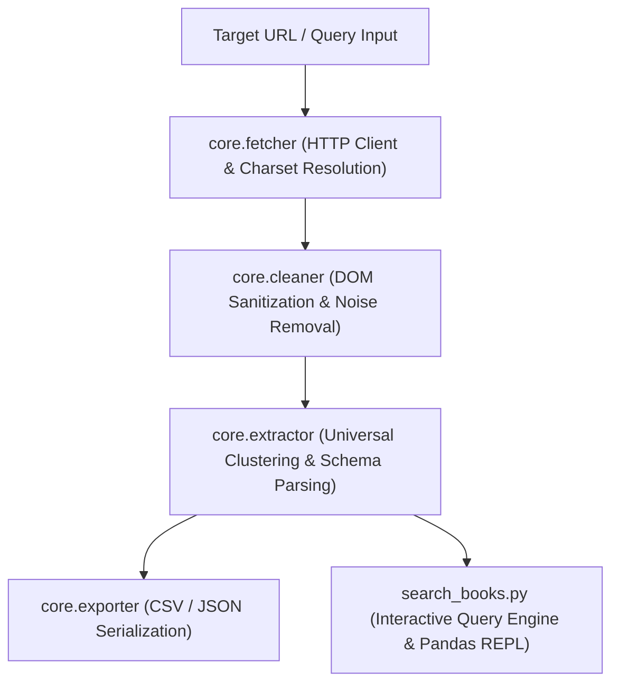

# ScrapeAgent

Autonomous Web Scraping, Pattern Discovery, and Structured Data Extraction Engine.

[](https://www.python.org/)
[](https://opensource.org/licenses/MIT)
[](https://peps.python.org/pep-0008/)

---

## Overview

**ScrapeAgent** is a modular web scraping and extraction engine built in Python. Unlike conventional scrapers that rely on fragile, site-specific CSS selectors, ScrapeAgent employs structural heuristics to sanitize noisy HTML, identify repeating entity containers (e.g., product listings, articles, cards), and extract structured datasets dynamically.

The system also includes an end-to-end data pipeline: multi-page pagination with rate limiting, two-level detail page enrichment, and an in-memory interactive query REPL backed by pandas.

---

## Key Capabilities

- **Universal Pattern Discovery**: Automatically detects recurring DOM clusters and repeating entities across arbitrary websites without manual selector mapping.
- **Noise Filtration & DOM Sanitization**: Removes non-semantic tags (`script`, `style`, `noscript`, `svg`, `iframe`) while preserving structured metadata (`application/ld+json`, OpenGraph).
- **Resilient HTTP Client**: Enforces polite `User-Agent` headers, automatic character encoding detection (handling currency symbols and multi-byte characters), and timeout protection.
- **Bot & Challenge Detection**: Identifies automated challenge walls (e.g., Cloudflare, reCAPTCHA) and produces actionable diagnostics.
- **Multi-Level Extraction Pipeline**: Crawls catalog listing pages and recursively enriches entities by fetching detail pages for deep attributes.
- **Interactive Query Engine**: Provides an in-terminal REPL to search, filter with boolean masks, sort, compute aggregate statistics, and export sub-views to CSV.

---

## Architecture



---

## Directory Structure

```text
scrape-agent/
|-- desktop_gui.py         # Native Windows Desktop GUI Application (Tkinter)
|-- create_shortcut.py     # Custom icon generator & Desktop shortcut installer
|-- run_desktop_app.bat    # Windows double-click launcher
|-- ScrapeAgent.bat        # Windows desktop application shortcut
|-- ScrapeAgent.vbs        # Zero-terminal silent VBS launcher
|-- run.bat                # Terminal launcher script
|-- agent.py               # CLI agent interface
|-- config.py              # Central configuration (User-Agents, timeouts, export formats)
|-- assets/                # Application branding & Windows icon assets
|   |-- scrape_agent.ico   # High-resolution multi-size Windows icon (16x16 to 256x256)
|   |-- scrape_agent.png   # High-resolution emblem graphics
|-- scrape_books.py        # Single-page catalog scraper (Phase 1)
|-- scrape_all_books.py    # Multi-page pagination & detail enrichment scraper (Phase 2)
|-- search_books.py        # Interactive search, filter, and analytics REPL (Phase 3)
|-- requirements.txt       # Project dependencies
|-- all_books.csv          # Generated catalog dataset
|-- books.csv              # Single-page baseline dataset
|-- core/                  # Core extraction framework
|   |-- __init__.py
|   |-- fetcher.py         # Resilient HTTP transport layer
|   |-- browser_fetcher.py # Headless browser transport (Playwright)
|   |-- cleaner.py         # Markup sanitization and JSON-LD retention
|   |-- extractor.py       # Heuristic pattern discovery and entity parser
|   |-- exporter.py        # Multi-format data serialization
|-- examples/              # Specialized scrapers and reference implementations
|   |-- __init__.py
|   |-- book_scraper.py
```

---

## Installation

### Prerequisites

- Python 3.10 or higher
- pip package manager

### Setup

Clone the repository and install the dependencies:

```bash
git clone https://github.com/AslanRunner/scrape-agent.git
cd scrape-agent
python -m pip install -r requirements.txt
```

---

## Usage Guide

### 1. Native Desktop GUI Application

Launch the desktop application with zero console windows by double-clicking **`ScrapeAgent.vbs`** (or **`run_desktop_app.bat`** / **`ScrapeAgent.bat`**), or execute:

```bash
pythonw desktop_gui.py
```

**Desktop GUI Features:**
- **Zero-Terminal Window**: Opens instantly as a pure native Windows window without any CMD terminal flash.
- **URL Extraction Bar**: Input any target web address directly, toggle between HTTP Engine and Playwright Chromium, and extract with one click.
- **Full-Window Interactive Table**: View and explore extracted records in a responsive, scrollable table with real-time text filtering.
- **One-Click Exports**: Save extracted datasets directly to CSV or JSON with native Windows save dialogs.
- **One-Click Folder Access**: Open the output directory in Windows File Explorer.

---

### 2. Command-Line Interface (CLI)

#### Interactive Terminal Menu
```bash
python agent.py
```

#### Direct Headless URL Extraction
```bash
# Export extracted items to CSV
python agent.py --url "https://books.toscrape.com/" --output "books.csv"

# Export extracted items to JSON
python agent.py --url "https://books.toscrape.com/" --output "books.json"

# Scrape dynamic JavaScript / SPA pages using headless browser
python agent.py --url "https://example.com" --browser --output "rendered_data.csv"
```

---

### 2. Catalog Scraping Pipeline

#### Phase 1: Single-Page Extraction

Fetches the homepage catalog (20 items), parses title attributes, normalized prices, ratings, and stock status:

```bash
python scrape_books.py
```

#### Phase 2: Full Catalog Pagination & Detail Enrichment

Traverses all 50 pagination pages (1,000 items) and performs two-level scraping to retrieve detail attributes (UPC, exact stock count, category, full description):

```bash
# Scrape the entire catalog (50 pages, 1,000 books)
python scrape_all_books.py

# Quick test run limited to N pages
python scrape_all_books.py --pages 3
```

---

### 3. Interactive Search & Analysis REPL

Query and analyze the generated dataset using pandas-backed operations:

```bash
python search_books.py
```

#### Supported REPL Commands

| Command | Syntax Example | Description |
| :--- | :--- | :--- |
| `stats` | `stats` | Displays catalog statistics (record count, category count, average price, price range, rating breakdown). |
| `search` | `search mystery` | Performs a case-insensitive substring search across title, description, and category. |
| `filter` | `filter category=Mystery min_price=30 rating>=4` | Applies combined boolean masks on category, price range, and rating. |
| `sort` | `sort price desc` | Sorts the current filtered view by column (`asc` or `desc`) without mutating state. |
| `save` | `save filtered_results.csv` | Exports the current query view to a CSV file. |
| `reset` | `reset` | Clears all active filters and restores the full catalog view. |
| `help` | `help` | Prints the available command reference. |
| `quit` | `quit` | Terminates the REPL session. |

---

## Technical Specifications

| Component | Implementation |
| :--- | :--- |
| **HTTP Transport** | `requests` with custom headers, configurable timeout, and explicit encoding fallback |
| **Browser Engine** | `Playwright` (Headless Chromium with navigator evasions for dynamic SPA rendering) |
| **DOM Parsing** | `BeautifulSoup4` (`html.parser`) |
| **Data Engine** | `pandas` (Vectorized boolean indexing, aggregation, series transformation) |
| **Serialization** | Standard library `csv` (`DictWriter`, UTF-8, strict newline handling) and `json` |
| **Rate Limiting** | Configurable inter-request delay (`time.sleep`) to prevent IP throttling |

---

## Roadmap

- [x] Polite HTTP client with automatic charset detection
- [x] Markup noise suppression and JSON-LD preservation
- [x] Heuristic repeating entity detection
- [x] Anti-bot and challenge screen diagnostics
- [x] Multi-page automated pagination crawling
- [x] Two-level scraping with detail page attribute enrichment
- [x] In-terminal interactive analysis REPL
- [x] Headless browser integration (Playwright) for client-side rendered (SPA) sites
- [ ] Automated proxy rotation and request concurrency pool
- [ ] LLM function-calling integration for natural language schema extraction

---

## Legal & Ethical Scraping Policy

ScrapeAgent is developed strictly for educational, testing, and research purposes. Web scraping activities are subject to legal and regulatory frameworks, as well as the target platform's Terms of Service (ToS).

- **Respect robots.txt**: Verify each target website's `robots.txt` policy and crawl directives prior to extraction.
- **Rate Limiting & Politeness**: Do not overwhelm remote servers. Use sensible delays between requests to prevent service degradation.
- **Data Privacy**: Ensure compliance with applicable data privacy regulations (e.g., GDPR, KVKK, CCPA). Do not collect or distribute personally identifiable information (PII).
- **Responsibility**: The user assumes all responsibility and liability for their use of this software, including adherence to platform-specific Terms of Service and local laws.

---

## License

This project is licensed under the MIT License. See the `LICENSE` file for details.
